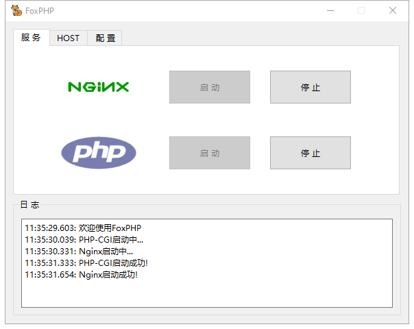
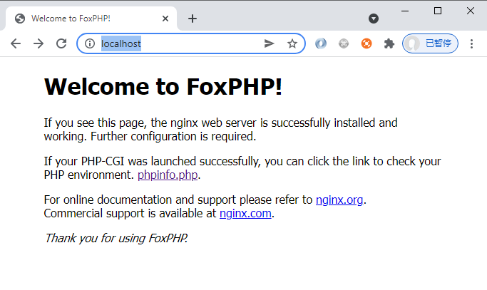

### FoxPHP

一个轻量级的Nginx+PHP8环境，下载后安装即可运行。  
A lightweight PHP development environment built on Nginx+PHP8 for windows, Can be run directly after installation without any third-party environment or dependencies.  


[Click here to download](./FoxPHPInstaller.exe?raw=true)


  
Check phpinfo: http://localhost/phpinfo.php

##### HOST用法
本地开发，线上数据库，将数据库服务器IP改为host连接，并绑定IP这样既可实现在公司电脑上是外网IP，线上服务器上用内网IP，另外对于小程序有域名限制，切到开发域名上容易忘记改，可以将线上域名绑定HOST，通过快捷键快速切换域名走本地。  
软件将会操作#BeginFoxPHP 到 #EndFoxPHP区间的host配置


##### 统托盘Icon颜色  
灰色：服务未启动   
蓝色：部分服务启动  
黄色：Nginx和PHPCGI均运行中 

默认启动软件将启动所有服务


##### Screenshots
托盘：  
  
主界面：  
  
安装访问：  


##### 集成扩展
```cli
PS D:\workspace> php -m
[PHP Modules]
apcu
bcmath
bz2
calendar
Core
ctype
curl
date
dom
exif
FFI
fileinfo
filter
ftp
gd
gettext
gmp
hash
iconv
imagick
imap
intl
json
ldap
libxml
mbstring
mongodb
mysqli
mysqlnd
mcrypt
odbc
openssl
pcre
PDO
pdo_mysql
Phar
readline
redis
Reflection
session
SimpleXML
sockets
SPL
standard
tokenizer
xml
xmlreader
xmlwriter
xsl
zip
zlib

[Zend Modules]
opcache
xdebug
```

软件最初内部用的，适合开发线上项目本地调试的，省去每次提交到服务器调试，所以不带MYSQL（这样还能节省开发终端CPU及内存资源消耗^_^）  


